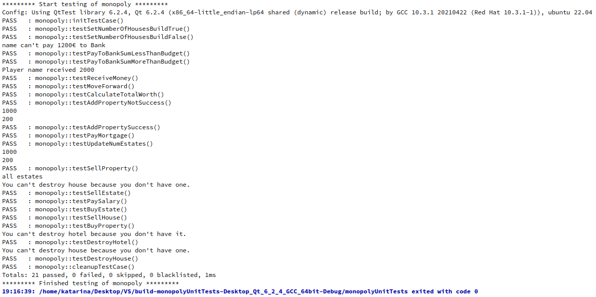
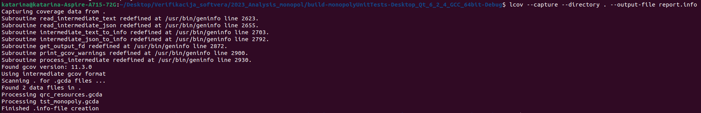
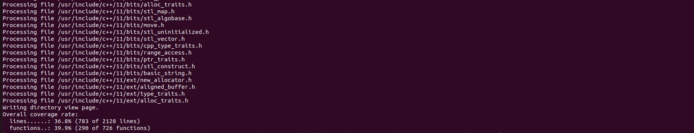
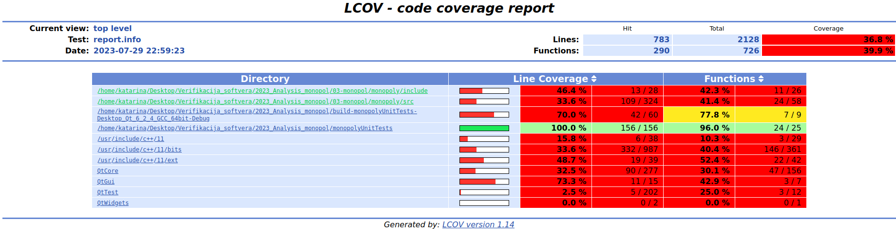
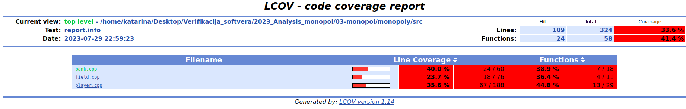
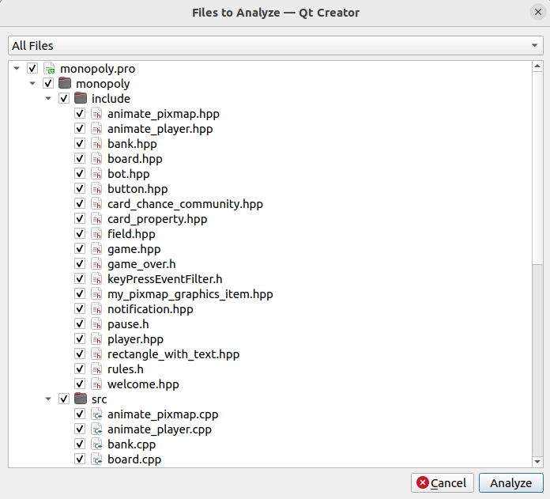
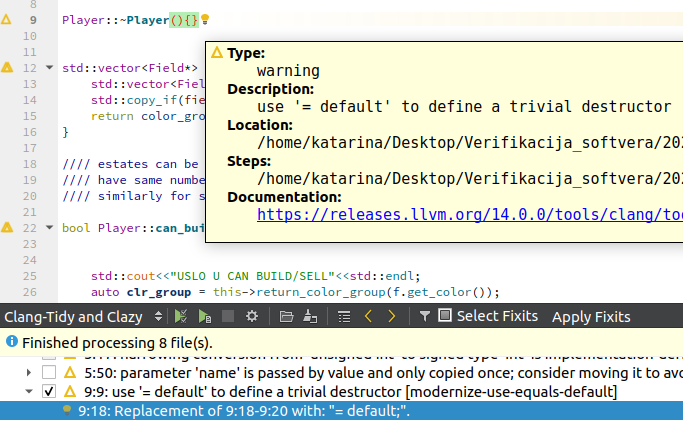
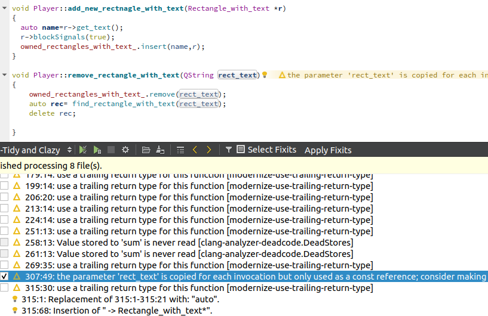

# Izveštaj analize projekta

## Uvod
- Analiza i primena alata je izvršena na projektu **"Monopoly"**, koji se nalazi na adresi: https://gitlab.com/matf-bg-ac-rs/course-rs/projects-2020-2021/03-monopol. 

- Projekat je implementacija društvene igre "Monopol". Na početku partije, korisnik unosi svoje korisničko ime i bira jedan od ponuđenih tokena, a takođe može i da pročita pravila igre. Kada igra počne, pored korisnika, na tabli se nalaze još tri protivnička igrača, tri bota. Implementirana su sva pravila koja zaista postoje u ovoj igri. Pobednik je takmičar koji poslednji ostane u igri, odnosno onaj koji nije bankrotirao.

- Za implementaciju projekta korišćen je programski jezik **C++** i radni okvir **Qt**. 
- Alati koji su korišćeni:
    - **QtTest** - testiranje jedinica koda
    - **Gcov** - pokrivenost koda testovima
    - **Memcheck** - otkrivanje curenja memorije, upotreba memorije
    - **Massif** - upotreba memorije, raspolaganje hipom i stekom tokom igre
    - **Clang-tidy and Clazy** - statička analiza koda.

## Unit Testing - QtTest

- Unit testovi, odnosno testovi jedinica koda, predstavljaju vrstu dinamičke verifikacije softvera. Pomoću njih se utvrđuje ispravnost manjih jedinica sistema, to mogu biti različite celine u zavisnosti od paradigme koja je korišćena.
- U ovom projektu dominira objektno-orijentisana paradigma, pa su u skladu sa tim testirani metodi na nivou klasa. Testirane su klase: **Player**, **Bank** i **Field**. Najpre je kreiran zaseban Qt projekat, tipa auto test project, koji automatski generiše kostur .pro fajla, kao i same klase tst_monopoly.cpp.  


- Testovi kojima se testira klasa **Player**:
    - void testSetNumberOfHousesBuildTrue();
        - Test proverava rad metoda set_number_of_houses kojim se postavlja vrednost parametra broja kuća na određenu vrednost u zavisnosti od vrednosti prodleđenog parametra - uvećava se.

    - void testSetNumberOfHousesBuildFalse();
        - Test proverava rad metoda set_number_of_houses kojim se postavlja vrednost parametra broja kuća na određenu vrednost u zavisnosti od vrednosti prodleđenog parametra - ostaje isti.

    - void testPayToBankSumLessThanBudget();
        - Test proverava rad metoda pay_to_bank kojim se vrsi isplata banci u jer je iznos manji od trenutnog budžeta igrača.

    - void testPayToBankSumMoreThanBudget();
        - Test proverava rad metoda pay_to_bank kojim se ne vrsi isplata banci jer je iznos veći od trenutnog budžeta igrača.

    - void testReceiveMoney();
        - Test proverava rad metoda receive_money kojim se povećava vrednost budžeta prilikom uplate neke sume igraču.

    - void testMoveForward();
        - Test proverava rad metoda move_forward kojim se vrši kretanje igrača po tabli i time mu se menja tekuća pozicija.

    - void testCalculateTotalWorth()
        - Test proverava rad metoda calculate_total_worth koji racuna ukupnu vrednost svih poseda i nekretnina koje igrač poseduje.

    - void testAddPropertyNotSuccess();
        - Test proverava rad metoda add_property kojim se ne kupuje posed jer ne postoji dovoljna kolicina novca u budžetu.

    - void testAddPropertySuccess();
        - Test proverava rad metoda add_property kojim se kupuje uspesno posed jer postoji dovoljna kolicina novca u budžetu.

    - void testPayMortgage();
        - Test proverava rad metoda pay_mortgage koji viši proveru mogućnosti placanja hipoteke u zavisnosti od trenutnog budžeta.

    - void testUpdateNumEstates();
        - Test proverava rad metoda update_num_estates koji vrši ažuriranje broja nekretnina u zavisnosti od njene vrste.

    - void testSellProperty();
        - Test provrava rad metoda sell_property kojim se vrši prodaja čitavog poseda. 

    - void testSellEstate();
        - Test proverava rad metoda sell_estate kojim se vrši prodaja nekretnine sa prosleđenog poseda u zavisnosti od vrste nekretnine na posedu.

- Testovi kojima se testira klasa **Bank**:
    - void testPaySalary();
        - Test proverava rad metoda pay_salary kojim se isplaćuje plata iz budžeta banke.

    - void testBuyEstate();
        - Test proverava rad metoda buy_estate kojim banka kupuje nekretnine.

    - void testSellHouse();
        - Test proverava rad metoda sell_house kojim banka prodaje nekretnine tipa kuća novcem iz svog budžeta.

    - void testBuyProperty()
        - Test proverava rad metoda buy_property kojim banka prodaje posede novcem iz svog budžeta.

- Testovi kojima se testira klasa **Field**:
    - void testDestroyHotel();
        - Test proverava rad metoda destroy_hotel kojim se smanjuje broj hotela na posedu. 

    - void testDestroyHouse();
        - Test proverava rad metoda destroy_house kojim se smanjuje broj kuća na posedu. 


- U nastavku je data izlaz pokretanja projekta monopolyUnitTests: 


- **Zakljucak**: Sa slike se može primetiti da su svi napisani testovi uspešno prošli i  time se potvrđuje funkcionalnost testiranih metoda - oni zaista rade ono što se od njih očekuje. Međutim, to ne znači nuzno da su svi metodi ispravni. Više o tome će biti reči u sledećoj temi - pokrivenosti koda testovima.


## Code coverage - Gcov

- Nakon testiranja jedinica koda, neophodno je iskoristiti neku metriku pomoću koje se procenjuje kolika je pokrivenost koda tim testovima i u te svrhe je korišćen alat Gcov.
- Najpre, neophodno je izmeniti .pro fajl projekta u kome su napisani testovi da bi se pratila ova metrika. To je moguće uraditi na jednostavan način, dodavanjem sledećeg:
```
QMAKE_CXXFLAGS += --coverage
QMAKE_LFLAGS += --coverage
```

- Prilikom build procesa nastaju dodatni .gcda i .gcno fajlovi. Nakon toga ovako izgrađen program se izvršava. Nakon izvršavanja se može izgenerisati izveštaj na sledeći način:
```
lcov --capture --directory . --output-file report.info
```



- Ovako dobijen izveštaj je veoma nečitljiv, ali se može sledećom komandom otvoriti detaljan pregled pokrivenosti koda u veb pregledaču:
```
genhtml -o result report.info
```


- Sledi pregled index.html stranice:




- **Zaključak**: Na poslednjoj slici se vidi da pokrivenost linija iznosi **36,8**, dok je pokrivenost funkcija **39,9**. Ove vrednosti nisu dovoljne i ne smatraju se dobrom, već niskom pokrivenošću, ali su značajan napredak u odnosu na raniju verziju gde testova nije ni bilo. Iz navedenog je jasno da uz mali broj napisanih testova se značajno popravlja pokrivenost i time se osigurava ispravnost koda - da li radi ono sto se od njega očekuje. Jasno se vidi iz sadržaja dokumenta index.html da je zapravo pokrivenost dostigla određeni procenat zahvaljujući testovima koji su napisani, za klase **Player**, **Bank** i **Field**. Međutim, iako uz par testova postignut neki stepen pokrivenosti linija i funcija, nekada to nije dovoljna metrika, već je neophodno da postoji i visok stepen pokrivenosti grana što ovde svakako nije slučaj. Kod koji nije testiran se smatra veoma lošim, a često i neupotrebljivim, i treba težati pokrivenosti od približno 100%.


## Valgrind - memcheck

- Valgrind je platforma otvorenog koda za naprednu dinamičku analizu. On obuhvata nekoliko alata od kojih je svaki specijalizovan za detektovanje određenog problema. Memcheck je najpoznatiji među njima i koristi se za detektovanje memorijskih grešaka i radi analizu nad mašinskim kodom. Može se koristiti za otkrivanje više vrsta problema poput:
    - upisivanje vrednosti van granica opsega
    - pristupanje već oslobođenoj memoriji
    - curenje memorije
    - korišćenje neinicijalizovanih vrednosti ...

- Ovde je od posebnog interesa otkrivanje curenja memorije jer je tokom inicijalne analize projekta **Monopoly** primećeno da su destruktori većinom ispravno napisani, iako ima i nekih grešaka (nedostaje oslobađanje nekih objekata) i nikada nije pozvan operator **delete** nad glavnom klasom. 
- Projekat ima napisan i CMakeLists.txt i .pro fajl, sto znaci da može da se izgrađuje kako pomoću cmake-a, tako i qmake-a. Za potrebe demonstracije ovog alata, korišćen je cmake.
- Prvo je projekat izgrađen:
``` 
cmake -G "Unix Makefiles" .
make
```
U okviru CMakeLists.txt je dodat fleg za debag režim, kako bi se izbacile sve optimizacije i ovime cmake pravi make file sa odgovarajućom konfiguracijom čijim pozivom se projekat izgrađuje. Poslednji korak je pokretanje izvršavanja programa sa flegovima za sam alat memcheck, kao i fleg za ispisivanje izveštaja u izlazni fajl:
``` valgrind --leak-check=full --track-origins=yes --log-file=valgrind_output.txt ./monopoly ```.

- U nastavku se nalazi tako izgenerisani izveštaj:

```
==7607== Memcheck, a memory error detector
==7607== Copyright (C) 2002-2017, and GNU GPL'd, by Julian Seward et al.
==7607== Using Valgrind-3.18.1 and LibVEX; rerun with -h for copyright info
==7607== Command: ./monopoly
==7607== Parent PID: 5046
==7607== 
==7607== Invalid read of size 8
==7607==    at 0x40286C8: strncmp (strcmp.S:172)
==7607==    by 0x400668D: is_dst (dl-load.c:216)
==7607==    by 0x400810E: _dl_dst_count (dl-load.c:253)
==7607==    by 0x400810E: expand_dynamic_string_token (dl-load.c:395)
==7607==    by 0x40082B7: fillin_rpath.isra.0 (dl-load.c:483)
==7607==    by 0x4008602: decompose_rpath (dl-load.c:654)
==7607==    by 0x400ABF5: cache_rpath (dl-load.c:696)
==7607==    by 0x400ABF5: cache_rpath (dl-load.c:677)
==7607==    by 0x400ABF5: _dl_map_object (dl-load.c:2165)
==7607==    by 0x4003494: openaux (dl-deps.c:64)
==7607==    by 0x5F30C27: _dl_catch_exception (dl-error-skeleton.c:208)
==7607==    by 0x4003C7B: _dl_map_object_deps (dl-deps.c:248)
==7607==    by 0x400EA0E: dl_open_worker_begin (dl-open.c:592)
==7607==    by 0x5F30C27: _dl_catch_exception (dl-error-skeleton.c:208)
==7607==    by 0x400DF99: dl_open_worker (dl-open.c:782)
==7607==  Address 0xf12e269 is 9 bytes inside a block of size 15 alloc'd
==7607==    at 0x4848899: malloc (in /usr/libexec/valgrind/vgpreload_memcheck-amd64-linux.so)
==7607==    by 0x40271FF: malloc (rtld-malloc.h:56)
==7607==    by 0x40271FF: strdup (strdup.c:42)
==7607==    by 0x4008594: decompose_rpath (dl-load.c:629)
==7607==    by 0x400ABF5: cache_rpath (dl-load.c:696)
==7607==    by 0x400ABF5: cache_rpath (dl-load.c:677)
==7607==    by 0x400ABF5: _dl_map_object (dl-load.c:2165)
==7607==    by 0x4003494: openaux (dl-deps.c:64)
==7607==    by 0x5F30C27: _dl_catch_exception (dl-error-skeleton.c:208)
==7607==    by 0x4003C7B: _dl_map_object_deps (dl-deps.c:248)
==7607==    by 0x400EA0E: dl_open_worker_begin (dl-open.c:592)
==7607==    by 0x5F30C27: _dl_catch_exception (dl-error-skeleton.c:208)
==7607==    by 0x400DF99: dl_open_worker (dl-open.c:782)
==7607==    by 0x5F30C27: _dl_catch_exception (dl-error-skeleton.c:208)
==7607==    by 0x400E34D: _dl_open (dl-open.c:883)
==7607== 
==7607== Invalid read of size 8
==7607==    at 0x40286C8: strncmp (strcmp.S:172)
==7607==    by 0x400668D: is_dst (dl-load.c:216)
==7607==    by 0x4007F79: _dl_dst_substitute (dl-load.c:295)
==7607==    by 0x40082B7: fillin_rpath.isra.0 (dl-load.c:483)
==7607==    by 0x4008602: decompose_rpath (dl-load.c:654)
==7607==    by 0x400ABF5: cache_rpath (dl-load.c:696)
==7607==    by 0x400ABF5: cache_rpath (dl-load.c:677)
==7607==    by 0x400ABF5: _dl_map_object (dl-load.c:2165)
==7607==    by 0x4003494: openaux (dl-deps.c:64)
==7607==    by 0x5F30C27: _dl_catch_exception (dl-error-skeleton.c:208)
==7607==    by 0x4003C7B: _dl_map_object_deps (dl-deps.c:248)
==7607==    by 0x400EA0E: dl_open_worker_begin (dl-open.c:592)
==7607==    by 0x5F30C27: _dl_catch_exception (dl-error-skeleton.c:208)
==7607==    by 0x400DF99: dl_open_worker (dl-open.c:782)
==7607==  Address 0xf12e269 is 9 bytes inside a block of size 15 alloc'd
==7607==    at 0x4848899: malloc (in /usr/libexec/valgrind/vgpreload_memcheck-amd64-linux.so)
==7607==    by 0x40271FF: malloc (rtld-malloc.h:56)
==7607==    by 0x40271FF: strdup (strdup.c:42)
==7607==    by 0x4008594: decompose_rpath (dl-load.c:629)
==7607==    by 0x400ABF5: cache_rpath (dl-load.c:696)
==7607==    by 0x400ABF5: cache_rpath (dl-load.c:677)
==7607==    by 0x400ABF5: _dl_map_object (dl-load.c:2165)
==7607==    by 0x4003494: openaux (dl-deps.c:64)
==7607==    by 0x5F30C27: _dl_catch_exception (dl-error-skeleton.c:208)
==7607==    by 0x4003C7B: _dl_map_object_deps (dl-deps.c:248)
==7607==    by 0x400EA0E: dl_open_worker_begin (dl-open.c:592)
==7607==    by 0x5F30C27: _dl_catch_exception (dl-error-skeleton.c:208)
==7607==    by 0x400DF99: dl_open_worker (dl-open.c:782)
==7607==    by 0x5F30C27: _dl_catch_exception (dl-error-skeleton.c:208)
==7607==    by 0x400E34D: _dl_open (dl-open.c:883)
==7607== 
==7607== 
==7607== HEAP SUMMARY:
==7607==     in use at exit: 28,906,926 bytes in 14,128 blocks
==7607==   total heap usage: 607,720 allocs, 593,592 frees, 851,672,398 bytes allocated
==7607== 
==7607== 116 (80 direct, 36 indirect) bytes in 1 blocks are definitely lost in loss record 3,395 of 4,178
==7607==    at 0x4849013: operator new(unsigned long) (in /usr/libexec/valgrind/vgpreload_memcheck-amd64-linux.so)
==7607==    by 0x15BEA8: Game::Game(Board*, QString, QString) (game_logic.cpp:15)
==7607==    by 0x1909E7: main (main.cpp:56)
==7607== 
==7607== 160 bytes in 1 blocks are possibly lost in loss record 3,566 of 4,178
==7607==    at 0x4848899: malloc (in /usr/libexec/valgrind/vgpreload_memcheck-amd64-linux.so)
==7607==    by 0x58F4C84: QObjectPrivate::addConnection(int, QObjectPrivate::Connection*) (in /usr/lib/x86_64-linux-gnu/libQt5Core.so.5.15.3)
==7607==    by 0x58F8BA7: ??? (in /usr/lib/x86_64-linux-gnu/libQt5Core.so.5.15.3)
==7607==    by 0x58FEEAE: QObject::connect(QObject const*, char const*, QObject const*, char const*, Qt::ConnectionType) (in /usr/lib/x86_64-linux-gnu/libQt5Core.so.5.15.3)
==7607==    by 0x4A7B2D7: ??? (in /usr/lib/x86_64-linux-gnu/libQt5Widgets.so.5.15.3)
==7607==    by 0x4A84444: ??? (in /usr/lib/x86_64-linux-gnu/libQt5Widgets.so.5.15.3)
==7607==    by 0x4A84C64: ??? (in /usr/lib/x86_64-linux-gnu/libQt5Widgets.so.5.15.3)
==7607==    by 0x4A86D64: ??? (in /usr/lib/x86_64-linux-gnu/libQt5Widgets.so.5.15.3)
==7607==    by 0x4AD535D: QAbstractButton::iconSize() const (in /usr/lib/x86_64-linux-gnu/libQt5Widgets.so.5.15.3)
==7607==    by 0x4B7C3A4: QPushButton::initStyleOption(QStyleOptionButton*) const (in /usr/lib/x86_64-linux-gnu/libQt5Widgets.so.5.15.3)
==7607==    by 0x4B7CFF9: ??? (in /usr/lib/x86_64-linux-gnu/libQt5Widgets.so.5.15.3)
==7607==    by 0x1870F2: Ui_Pause::setupUi(QDialog*) (ui_pause.h:45)
==7607== 
==7607== 288 (256 direct, 32 indirect) bytes in 1 blocks are definitely lost in loss record 3,722 of 4,178
==7607==    at 0x4848899: malloc (in /usr/libexec/valgrind/vgpreload_memcheck-amd64-linux.so)
==7607==    by 0x98EAA21: ??? (in /usr/lib/x86_64-linux-gnu/libfontconfig.so.1.12.0)
==7607==    by 0x98ED590: ??? (in /usr/lib/x86_64-linux-gnu/libfontconfig.so.1.12.0)
==7607==    by 0x98F7B7C: ??? (in /usr/lib/x86_64-linux-gnu/libfontconfig.so.1.12.0)
==7607==    by 0x9AD1A13: ??? (in /usr/lib/x86_64-linux-gnu/libexpat.so.1.8.7)
==7607==    by 0x9ACFD7D: ??? (in /usr/lib/x86_64-linux-gnu/libexpat.so.1.8.7)
==7607==    by 0x9AD0C6B: ??? (in /usr/lib/x86_64-linux-gnu/libexpat.so.1.8.7)
==7607==    by 0x9AD4DF4: XML_ParseBuffer (in /usr/lib/x86_64-linux-gnu/libexpat.so.1.8.7)
==7607==    by 0x98F9332: ??? (in /usr/lib/x86_64-linux-gnu/libfontconfig.so.1.12.0)
==7607==    by 0x98F9AE8: ??? (in /usr/lib/x86_64-linux-gnu/libfontconfig.so.1.12.0)
==7607==    by 0x98F9C9D: ??? (in /usr/lib/x86_64-linux-gnu/libfontconfig.so.1.12.0)
==7607==    by 0x98F5ACB: ??? (in /usr/lib/x86_64-linux-gnu/libfontconfig.so.1.12.0)
==7607== 
==7607== 480 bytes in 3 blocks are possibly lost in loss record 3,871 of 4,178
==7607==    at 0x4848899: malloc (in /usr/libexec/valgrind/vgpreload_memcheck-amd64-linux.so)
==7607==    by 0x58F4C84: QObjectPrivate::addConnection(int, QObjectPrivate::Connection*) (in /usr/lib/x86_64-linux-gnu/libQt5Core.so.5.15.3)
==7607==    by 0x58F8BA7: ??? (in /usr/lib/x86_64-linux-gnu/libQt5Core.so.5.15.3)
==7607==    by 0x58FEEAE: QObject::connect(QObject const*, char const*, QObject const*, char const*, Qt::ConnectionType) (in /usr/lib/x86_64-linux-gnu/libQt5Core.so.5.15.3)
==7607==    by 0x4A7B2D7: ??? (in /usr/lib/x86_64-linux-gnu/libQt5Widgets.so.5.15.3)
==7607==    by 0x4A84444: ??? (in /usr/lib/x86_64-linux-gnu/libQt5Widgets.so.5.15.3)
==7607==    by 0x4A84C64: ??? (in /usr/lib/x86_64-linux-gnu/libQt5Widgets.so.5.15.3)
==7607==    by 0x4A86D64: ??? (in /usr/lib/x86_64-linux-gnu/libQt5Widgets.so.5.15.3)
==7607==    by 0x4AD535D: QAbstractButton::iconSize() const (in /usr/lib/x86_64-linux-gnu/libQt5Widgets.so.5.15.3)
==7607==    by 0x4B7C3A4: QPushButton::initStyleOption(QStyleOptionButton*) const (in /usr/lib/x86_64-linux-gnu/libQt5Widgets.so.5.15.3)
==7607==    by 0x4B7CFF9: ??? (in /usr/lib/x86_64-linux-gnu/libQt5Widgets.so.5.15.3)
==7607==    by 0x4B7D967: QPushButton::event(QEvent*) (in /usr/lib/x86_64-linux-gnu/libQt5Widgets.so.5.15.3)
==7607== 
==7607== 832 (672 direct, 160 indirect) bytes in 2 blocks are definitely lost in loss record 3,959 of 4,178
==7607==    at 0x4849013: operator new(unsigned long) (in /usr/libexec/valgrind/vgpreload_memcheck-amd64-linux.so)
==7607==    by 0x4D044A5: QGraphicsItem::QGraphicsItem(QGraphicsItem*) (in /usr/lib/x86_64-linux-gnu/libQt5Widgets.so.5.15.3)
==7607==    by 0x1981AF: Card_Property::Card_Property(QString, QColor, int, int, int, int, int, int, int, int, int, Field_kind) (card_property.cpp:7)
==7607==    by 0x1AA4DC: Board::add_buttons(QGraphicsItem*) (board.cpp:514)
==7607==    by 0x1A6EEF: Board::display_table() (board.cpp:381)
==7607==    by 0x15C9AE: Game::initialize_board(QGraphicsScene*) (game_logic.cpp:41)
==7607==    by 0x190A4F: main (main.cpp:62)
==7607== 
==7607== 2,496 (480 direct, 2,016 indirect) bytes in 6 blocks are definitely lost in loss record 4,081 of 4,178
==7607==    at 0x4849013: operator new(unsigned long) (in /usr/libexec/valgrind/vgpreload_memcheck-amd64-linux.so)
==7607==    by 0x1AA47A: Board::add_buttons(QGraphicsItem*) (board.cpp:514)
==7607==    by 0x1A6EEF: Board::display_table() (board.cpp:381)
==7607==    by 0x15C9AE: Game::initialize_board(QGraphicsScene*) (game_logic.cpp:41)
==7607==    by 0x190A4F: main (main.cpp:62)
==7607== 
==7607== LEAK SUMMARY:
==7607==    definitely lost: 1,488 bytes in 10 blocks
==7607==    indirectly lost: 2,244 bytes in 10 blocks
==7607==      possibly lost: 640 bytes in 4 blocks
==7607==    still reachable: 28,902,554 bytes in 14,104 blocks
==7607==         suppressed: 0 bytes in 0 blocks
==7607== Reachable blocks (those to which a pointer was found) are not shown.
==7607== To see them, rerun with: --leak-check=full --show-leak-kinds=all
==7607== 
==7607== For lists of detected and suppressed errors, rerun with: -s
==7607== ERROR SUMMARY: 8 errors from 8 contexts (suppressed: 0 from 0)
```

- Na početku izveštaja se mogu videti neke greške povezane sa neispravnom upotrebnom memorije, verovatno pokušaj pristupa već oslobođenoj memoriji. Stek ukazuje na neke bibliotečke funkcije za poređenje stringova.
- U drugom delu izveštaja se mogu videti statistike za: definitivno, indirentno, moguće izgubljene, kao i one blokove na koje još uvek postoji referenca. Ovde je od interesa posmatrati definitivno izgubljene blokove, što je **1488 bajtova** i taj podatak nije baš pohvalan.
- Prvi problem ukazuje da objekat klase Game nikada nije oslobođen, dok npr. šesti ukazuje na problem pri pozivu metoda ```monopoly->initialize_board()```, kojim se kreira veliki broj objekata koji nikada nisu oslobođeni. Ostali primeri se odnose na neke bibliotečke funkcije čiji stek memcheck ne uspeva da isprati.

- Osnovna stvar koja je urađena jeste ignorisanje nekih Qt UI komponenti jer one dosta utiču na upravljanje memorijom. Zatim, neophodno je osloboditi klase: Game, Board i Welcome po završetku igre, u main klasi. To je neophodno uraditi korišćenjem operatora deleteLater, umesto obicnog delete. Takođe, u nekim destruktorima su dodata oslobađanja koja nisu ranije postojala, npr. u destruktoru klase **Game**, je oslobođen niz botova.
- Još jedna sitna izmena, koja je dosta uticala na smanjenje curenja memorije jeste oslobađanje jedne privremene promenljive koja je napravljena u metodi ``` Board::add_buttons()```, a pošto se kreira veliki broj ovakvih objekata, na ovaj način je spašeno dosta memorije od curenja.
- Sada izveštaj izgleda ovako:

```
LEAK SUMMARY:
==40122==    definitely lost: 256 bytes in 1 blocks
==40122==    indirectly lost: 32 bytes in 1 blocks
==40122==      possibly lost: 640 bytes in 4 blocks
==40122==    still reachable: 19,227,036 bytes in 12,892 blocks
==40122==         suppressed: 0 bytes in 0 blocks
==40122== Reachable blocks (those to which a pointer was found) are not shown.
==40122== To see them, rerun with: --leak-check=full --show-leak-kinds=all
==40122== 
==40122== For lists of detected and suppressed errors, rerun with: -s
==40122== ERROR SUMMARY: 4 errors from 4 contexts (suppressed: 0 from 0)
```

- **Zaključak**: Uz nekoliko manjih izmena curenje memorije je značajno smanjeno, sada iznosi **256 definitivno izgubljenih bajtova**, a bilo je **1488**. Ovo nije dovoljno i poželjno je da curenja uopšte nema, ali većina ostalih problema potiče od klasa koja dolaze iz Qt. 


## Valgrind - massif

- Sledeći alat koji je korišćen za analizu koda projekta Monopol je **massif**, alat za analizu hip memorije. On se koristi za otkrivanje posebne vrste curenja memorije - kada nije izgubljena referenca na neki objekat, već se on jednostavno ne koristi i time se troši velika količina memorije bespotrebno. 
- Prethodno izgrađen projekat, korišćenjem cmake alata se pokreće na sledeći način: 
``` valgrind --tool=massif ./monopoly ```
- Ovime se dobija izlaz koji je veoma nečitljivom formatu, a da bi se dobio željeni graf, izlaz se preusmerava korišćenjem ms_print-a:
``` ms_print massif.out.41769 > massif.txt ```

- Sadržaj fajla:

```
    MB
32.16^                                          @                             
     |           #::: ::::::::::@:::::::::::::::@:           ::::::@::     : :
     |           #::: :::::::: :@:::::::::::::::@:           ::::::@::     : :
     |           #::: :::::::: :@:::::::::::::::@:           ::::::@::     : :
     |           #::: :::::::: :@:::::::::::::::@:           ::::::@::     :::
     |           #:::@:::::::: :@:::::::::::::::@:::::@::::::@:::::@:::::@::::
     |           #:::@:::::::: :@:::::::::::::::@:::::@::::::@:::::@:::::@::::
     |           #:::@:::::::: :@:::::::::::::::@:::::@::::::@:::::@:::::@::::
     |           #:::@:::::::: :@:::::::::::::::@:::::@::::::@:::::@:::::@::::
     |           #:::@:::::::: :@:::::::::::::::@:::::@::::::@:::::@:::::@::::
     |         @:#:::@:::::::: :@:::::::::::::::@:::::@::::::@:::::@:::::@::::
     |         @:#:::@:::::::: :@:::::::::::::::@:::::@::::::@:::::@:::::@::::
     |         @:#:::@:::::::: :@:::::::::::::::@:::::@::::::@:::::@:::::@::::
     |         @:#:::@:::::::: :@:::::::::::::::@:::::@::::::@:::::@:::::@::::
     |        :@:#:::@:::::::: :@:::::::::::::::@:::::@::::::@:::::@:::::@::::
     |        :@:#:::@:::::::: :@:::::::::::::::@:::::@::::::@:::::@:::::@::::
     |       ::@:#:::@:::::::: :@:::::::::::::::@:::::@::::::@:::::@:::::@::::
     |       ::@:#:::@:::::::: :@:::::::::::::::@:::::@::::::@:::::@:::::@::::
     |      @::@:#:::@:::::::: :@:::::::::::::::@:::::@::::::@:::::@:::::@::::
     |::::::@::@:#:::@:::::::: :@:::::::::::::::@:::::@::::::@:::::@:::::@::::
   0 +----------------------------------------------------------------------->Gi
     0                                                                   3.940

Number of snapshots: 96
Detailed snapshots: [7, 11, 13 (peak), 17, 27, 49, 59, 69, 79, 89]

--------------------------------------------------------------------------------
  n        time(i)         total(B)   useful-heap(B) extra-heap(B)    stacks(B)
--------------------------------------------------------------------------------
  0              0                0                0             0            0
  1     58,551,805        1,744,232        1,669,188        75,044            0
  2    100,028,443        1,749,416        1,674,244        75,172            0
  3    155,849,561        2,348,096        2,199,966       148,130            0
  4    214,113,208        2,470,112        2,314,110       156,002            0
  5    252,160,743        2,611,544        2,381,905       229,639            0
  6    314,424,703        2,886,696        2,569,686       317,010            0
  7    363,682,025        4,550,912        4,233,113       317,799            0
```

- **Zaključak**: massif je napravio 96 preseka stanja, od kojih je posebno izdvojio neke, tako da se jasno vidi da se pik u utrošku memorije dostiže u **trinaestom** preseku i iznosi **32.16MB**. Podaci o ostalim presecima se mogu naći u priloženom fajlu. Na osnovu njega se može zaključiti da program troši razumnu količinu memorije i da nema nekih neobičnih promena, poput skokova ili padova, već se postepeno dostiže jedna vrednost i onda se manje-više osciluje oko nje.

- Slična statistika o upotrebi steka se može dobiti pokretanjem programa na isti način, uz dodavanje flega:
``` valgrind --tool=massif --stack=yes ./monopoly ```
- Sadržaj fajla:

```
    MB
32.19^                                              :                         
     |               #::::::::@@::::::::::::::::@::::@:::@::::@:::: :::::::   
     |               #:: :: : @ :: ::: : ::: :: @::::@: :@::::@:::: :::::::  :
     |               #:: :: : @ :: ::: : ::: :: @::::@: :@::::@:::: :::::::  :
     |               #:: :: : @ :: ::: : ::: :: @::::@: :@::::@:::: :::::::@::
     |               #:: :: : @ :: ::: : ::: :: @::::@: :@::::@::::@:::::::@::
     |               #:: :: : @ :: ::: : ::: :: @::::@: :@::::@::::@:::::::@::
     |               #:: :: : @ :: ::: : ::: :: @::::@: :@::::@::::@:::::::@::
     |               #:: :: : @ :: ::: : ::: :: @::::@: :@::::@::::@:::::::@::
     |               #:: :: : @ :: ::: : ::: :: @::::@: :@::::@::::@:::::::@::
     |             ::#:: :: : @ :: ::: : ::: :: @::::@: :@::::@::::@:::::::@::
     |             : #:: :: : @ :: ::: : ::: :: @::::@: :@::::@::::@:::::::@::
     |             : #:: :: : @ :: ::: : ::: :: @::::@: :@::::@::::@:::::::@::
     |             : #:: :: : @ :: ::: : ::: :: @::::@: :@::::@::::@:::::::@::
     |             : #:: :: : @ :: ::: : ::: :: @::::@: :@::::@::::@:::::::@::
     |            :: #:: :: : @ :: ::: : ::: :: @::::@: :@::::@::::@:::::::@::
     |          @@:: #:: :: : @ :: ::: : ::: :: @::::@: :@::::@::::@:::::::@::
     |         :@ :: #:: :: : @ :: ::: : ::: :: @::::@: :@::::@::::@:::::::@::
     |        @:@ :: #:: :: : @ :: ::: : ::: :: @::::@: :@::::@::::@:::::::@::
     | :::::::@:@ :: #:: :: : @ :: ::: : ::: :: @::::@: :@::::@::::@:::::::@::
   0 +----------------------------------------------------------------------->Gi
     0                                                                   2.834

Number of snapshots: 68
Detailed snapshots: [8, 10, 13 (peak), 20, 32, 37, 41, 46, 53, 63]

--------------------------------------------------------------------------------
  n        time(i)         total(B)   useful-heap(B) extra-heap(B)    stacks(B)
--------------------------------------------------------------------------------
  0              0                0                0             0            0
  1     27,686,357        1,472,120        1,406,836        60,132        5,152
  2     73,950,075        1,764,088        1,673,220        74,956       15,912
  3    109,280,593        2,157,976        2,011,521       128,951       17,504
  4    161,537,238        2,367,304        2,208,846       148,562        9,896
  5    206,057,158        2,462,040        2,297,470       154,674        9,896
  6    270,834,180        2,722,016        2,402,400       269,768       49,848
  7    320,243,546        2,905,080        2,570,304       316,888       17,888
  8    363,826,484        4,623,608        4,286,207       317,193       20,208
```

- **Zaključak**: massif je ovog puta napravio 68 preseka stanja, od kojih je posebno izdvojio neke, tako da se jasno vidi da se pik u utrošku memorije dostiže ponovo u **trinaestom** preseku i sada iznosi **32.19MB**. Podaci o ostalim presecima se mogu naći u priloženom fajlu. Na osnovu njega se može zaključiti veoma slično kao u prethodnom slučaju.


## Clang-tidy i Clazy

- Nakon obrade alata za dinamičku analizu koda, sledi jedan primer alata za statičku analizu koda - **Clang-tidy**. Ova vrsta analize omogućava analiziranje koda bez njegovog izvršavanja sa ciljem pronalaženja grešaka i samog poboljšanja kvaliteta koda. 

- Clang-tidy je alat koji u sebi ima ugrađen statički analizator **Clang**, a **Clazy** omogućava Clang-u da razume kod Qt-a. 
- Pogodnost koja omogućava veoma laku, brzu i efikasnu upotrebu ovog alata je to što je on ugrađen u samo Qt okruženje. U nasavku je dat primer upotrebe ovog alat upravo iz Qt okruženja.
- Najpre je potrebno klikom na tab, u gornjem meniju, ***Analize***, izabrati željeni alat, što je u ovo slučaju Clang-tidy i Clazy. Nakon čega se otvara sledeći prozor:



- Na ovom mestu se mogu odabrati klase koje će biti statički analizirane. Podrazumevano su označene sve, međutim moguće je odabrati samo neke od njih. Zbog brzine i efikasnosti alata je uobičajeno primeniti odjednom na ceo projekat. Međutim, ovde zbog veće preglednosti odabrano je samo nekoliko klasa: **Field**, **Game**, **Player** i **Bank**, njihove .cpp i .hpp fajlove. 
- Sledeći korak je klik na dugme Analyze nakon čega se generiše izveštaj. On se sastoji iz svih mogućih sugestija za izmenu, pregledno izdvojenih po klasama, sa kratkim objašnjenjem njihovog značenja i ukratko koracima za njihovu primenu. Svaku od tih pronađenih defekata je moguće manuelno izvršiti, ali i automatski, najpre čekiranjem željene izmene, a potom klikom na **Apply Fixits**. 
- Dva primera sugestija ovog alata koje su primenjene date su u nastavku:



- Dobra je praksa da kada je destruktor podrazumevan, umesto prazne implementacije u .cpp fajlu, se samo doda ključna reč **default** kod njegove deklaracije.



- Memorijski je dosta efikasnije prenositi veće objekte po referenci, takođe i konstantnoj referenci ukoliko neće biti menjani u tom metodu kojem se prosleđuju.

- **Zaključak**: Ovakva vrsta alata je veoma korisna, međutim nije uvek pametno primeniti sve sugestije koje je Clang-tidy izgenerisao. Nekada se neke od njih ne uklapaju u stil kodiranja koji se koristi ili čini kod još nečitljivijim, a takođe može doći i do nekih kolizija. Jedan primer toga jeste sugestija da se u svim povratnim vrednostima funcija koristi ključna reč **auto**. Iz tog razloga je bolje prvo pregledati detaljno izveštaj, odabrati željene izmene,  zatim primeniti automatski. U ovom projektu ima mesta za ispravke ovog tipa, ali ne u prevelikoj meri.


## Zaključak o projektu
- Problemi koji su uočeni na projektu:
    - curenje memorije - locirano je i otklonjeno u velikoj meri
    - nedostatak testova jedinica koda - delimično je testirano nekoliko klasa i utvrđen stepen pokrivenosti testovima
    - projektu nedostaje malo refaktorizacije, pojedini metodi su veoma veliki.
- Osim navedenog, projekat se ponaša u skladu sa očekivanim.