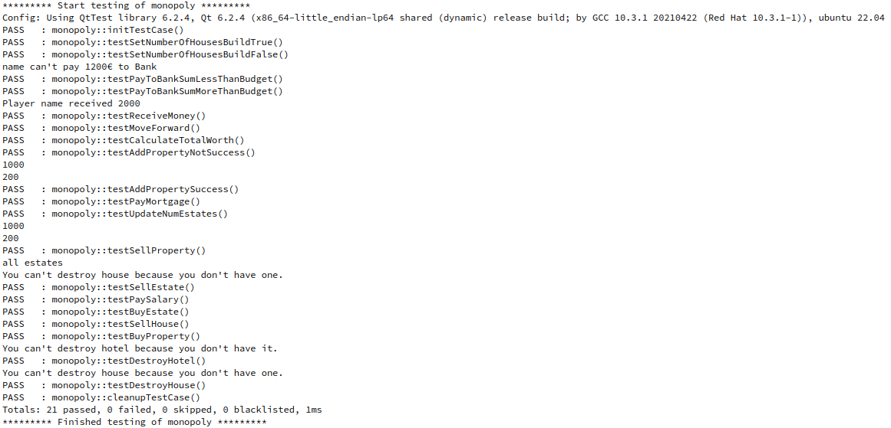

## Unit Testing - QtTest

- Unit testovi, odnosno testovi jedinica koda, predstavljaju vrstu dinamičke verifikacije softvera. Pomoću njih se utvrđuje ispravnost manjih jedinica sistema, to mogu biti različite celine u zavisnosti od paradigme koja je korišćena.
- U ovom projektu dominira objektno-orijentisana paradigma, pa su u skladu sa tim testirani metodi na nivou klasa. Testirane su klase: **Player**, **Bank** i **Field**. Najpre je kreiran zaseban Qt projekat, tipa auto test project, koji automatski generiše kostur .pro fajla, kao i same klase tst_monopoly.cpp.  


- Testovi kojima se testira klasa **Player**:
    - void testSetNumberOfHousesBuildTrue();
        - Test proverava rad metoda set_number_of_houses kojim se postavlja vrednost parametra broja kuća na određenu vrednost u zavisnosti od vrednosti prodleđenog parametra - uvećava se.

    - void testSetNumberOfHousesBuildFalse();
        - Test proverava rad metoda set_number_of_houses kojim se postavlja vrednost parametra broja kuća na određenu vrednost u zavisnosti od vrednosti prodleđenog parametra - ostaje isti.

    - void testPayToBankSumLessThanBudget();
        - Test proverava rad metoda pay_to_bank kojim se vrsi isplata banci u jer je iznos manji od trenutnog budžeta igrača.

    - void testPayToBankSumMoreThanBudget();
        - Test proverava rad metoda pay_to_bank kojim se ne vrsi isplata banci jer je iznos veći od trenutnog budžeta igrača.

    - void testReceiveMoney();
        - Test proverava rad metoda receive_money kojim se povećava vrednost budžeta prilikom uplate neke sume igraču.

    - void testMoveForward();
        - Test proverava rad metoda move_forward kojim se vrši kretanje igrača po tabli i time mu se pomera tekuća pozicija.

    - void testCalculateTotalWorth()
        - Test proverava rad metoda calculate_total_worth koji racuna ukupnu vrednost svih poseda i nekretnina koje igrač poseduje.

    - void testAddPropertyNotSuccess();
        - Test proverava rad metoda add_property kojim se ne kupuje posed jer ne postoji dovoljna kolicina novca u budžetu.

    - void testAddPropertySuccess();
        - Test proverava rad metoda add_property kojim se kupuje uspesno posed jer postoji dovoljna kolicina novca u budžetu.

    - void testPayMortgage();
        - Test proverava rad metoda pay_mortgage koji visi proveru mogucnosti placanja hipoteke u zavisnosti od trenutnog budžeta.

    - void testUpdateNumEstates();
        - Test proverava rad metoda update_num_estates koji vrsi ažuriranje broja nekretnina u zavisnosti od njene vrste.

    - void testSellProperty();
        - Test provrava rad metoda sell_property kojim se vrsi prodaja citavog poseda. 

    - void testSellEstate();
        - Test proverava rad metoda sell_estate kojim se vrsi prodaja nekretnine sa prosleđenog poseda u zavisnosti od vrste nekretnine na posedu.

- Testovi kojima se testira klasa **Bank**:
    - void testPaySalary();
        - Test proverava rad metoda pay_salary kojim se isplaćuje plata iz budžeta banke.

    - void testBuyEstate();
        - Test proverava rad metoda buy_estate kojim banka kupuje nekretnine.

    - void testSellHouse();
        - Test proverava rad metoda sell_house kojim banka prodaje nekretnine tipa kuća novcem iz svog budžeta.

    - void testBuyProperty()
        - Test proverava rad metoda buy_property kojim banka prodaje posede novcem iz svog budžeta.

- Testovi kojima se testira klasa **Field**:
    - void testDestroyHotel();
        - Test proverava rad metoda destroy_hotel kojim se smanjuje broj hotela na posedu. 

    - void testDestroyHouse();
        - Test proverava rad metoda destroy_house kojim se smanjuje broj kuća na posedu. 


- U nastavku je data izlaz pokretanja projekta monopolyUnitTests: 


- **Zakljucak**: Sa slike se može primetiti da su svi napisani testovi uspešno prošli i  time se potvrđuje funkcionalnost testiranih metoda - oni zaista rade ono što se od njih očekuje. Međutim, to ne znači nuzno da su svi metodi ispravni. Vise o tome će biti reči u sledećoj temi - pokrivenosti koda testovima.


## Code coverage - Gcov

- Nakon testiranja jedinica koda, neophodno je iskoristiti neku metriku pomoću koje se procenjuje kolika je pokrivenost koda tim testovima i u te svrhe je korišćen alat Gcov.
- Najpre, neophodno je izmeniti .pro fajl projekta u kome su napisani testovi da bi se pratila ova metrika. To je moguće uraditi na jednostavan način, dodavanjem sledećeg:
```
QMAKE_CXXFLAGS += --coverage
QMAKE_LFLAGS += --coverage
```

- Prilikom build procesa nastaju dodatni .gcda i .gcno fajlovi. Nakon toga ovako izgrađen program se izvršava. Nakon izvršavanja se može izgenerisati izveštaj na sledeći način:
```
lcov --capture --directory . --output-file report.info
```


- Ovako dobijen izveštaj je veoma nečitljiv, ali se može sledećom komandom otvoriti detaljan pregled pokrivenosti koda u veb pregledaču:
```
genhtml -o result report.info
```


- Sledi pregled index.html stranice:


- **Zaključak**: Na poslednjoj slici se vidi da pokrivenost linija iznosi **36,8**, dok je pokrivenost funkcija **39,9**. Ove vrednosti nisu dovoljne i ne smatraju se dobrom, već niskom pokrivenošću, ali su značajan napredak u odnosu na raniju verziju gde testova nije ni bilo. Iz navedenog je jasno da uz mali broj napisanih testova se značajno popravlja pokrivenost i time se osigurava ispravnost koda - da li radi ono sto se od njega očekuje. Jasno se vidi iz sadržaja dokumenta index.html da je zapravo pokrivenost dostigla određeni procenat zahvaljujući testovima koji su napisani, za klase **Player**, **Bank** i **Field**. Međutim, iako uz par testova postignut neki stepen pokrivenosti linija i funcija, nekada to nije dovoljna metrika, već je neophodno da postoji i visok stepen pokrivenosti grana što ovde svakako nije slučaj. Kod koji nije testiran se smatra veoma lošim, a često i neupotrebljivim, i treba težati pokrivenosti od približno 100%.